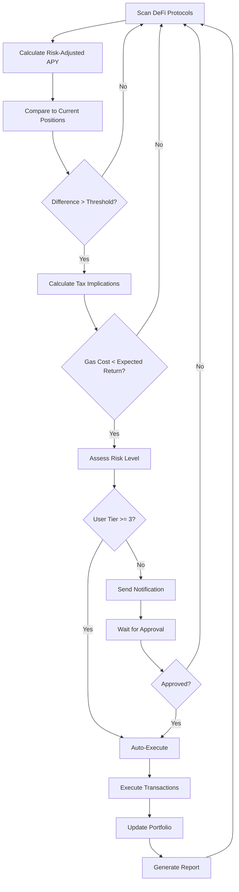
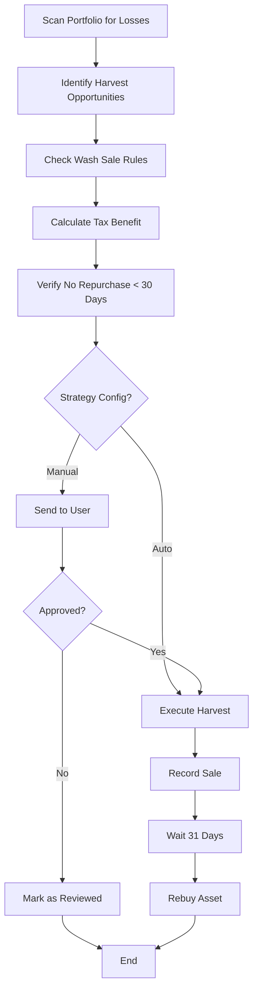
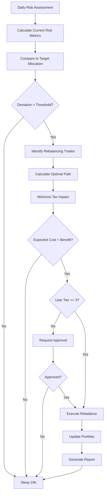

# Embedding Eliza into an AI-Powered Wallet: Architecture & Integration Strategies

## Executive Summary

This document explores multiple architectural approaches for embedding ElizaOS into an AI-powered wallet that provides autonomous financial management while maintaining strict user control and security. The vision is to create a wallet that **disconnects users from emotional trading decisions**, **scouts opportunities proactively**, **handles financial workflows autonomously**, and **provides intelligent financial guidance** through a multi-agent system with granular permission controls.

---

## Table of Contents

1. [Integration Approaches](#integration-approaches)
2. [User Experience Improvements](#user-experience-improvements)
3. [Access Control Framework](#access-control-framework)
4. [Browser Extension as Eliza's Eyes](#browser-extension-as-elizas-eyes)
5. [System Architecture](#system-architecture)
6. [Implementation Roadmap](#implementation-roadmap)
7. [Security Model](#security-model)
8. [Financial Automation Workflows](#financial-automation-workflows)
9. [Monitoring & Reporting](#monitoring--reporting)
10. [Model Agnostic Design](#model-agnostic-design)

---

## Integration Approaches

### Approach 1: Embedded Multi-Agent Architecture (Recommended)

**Concept:** Deploy multiple specialized Eliza agents within the wallet infrastructure, each with distinct roles and permissions.

```
┌─────────────────────────────────────────────────────────────┐
│                     AI Wallet System                         │
├─────────────────────────────────────────────────────────────┤
│  ┌─────────────┐  ┌─────────────┐  ┌─────────────┐         │
│  │  Research   │  │   Trading   │  │  Risk Mgmt  │         │
│  │   Agent     │  │   Agent     │  │   Agent     │         │
│  └─────────────┘  └─────────────┘  └─────────────┘         │
├─────────────────────────────────────────────────────────────┤
│  ┌─────────────┐  ┌─────────────┐  ┌─────────────┐         │
│  │ Portfolio   │  │  News/Sent  │  │ Compliance  │         │
│  │   Agent     │  │   Agent     │  │   Agent     │         │
│  └─────────────┘  └─────────────┘  └─────────────┘         │
├─────────────────────────────────────────────────────────────┤
│            Central Orchestrator (Eliza Core)                │
└─────────────────────────────────────────────────────────────┘
```

**Components:**

- **Research Agent**: Scans markets, analyzes opportunities, monitors trends
- **Trading Agent**: Executes approved trades based on confidence thresholds
- **Risk Management Agent**: Enforces limits, manages exposure, prevents losses
- **Portfolio Agent**: Rebalances, manages diversification, tracks performance
- **News/Sentiment Agent**: Monitors news, social media, sentiment analysis
- **Compliance Agent**: Ensures regulatory compliance, audit trails

**Pros:**
- ✅ Clear separation of concerns
- ✅ Easy to scale and add specialized agents
- ✅ Fault isolation - one agent failing doesn't crash the system
- ✅ Fine-grained permissions per agent type
- ✅ Natural alignment with financial roles

**Cons:**
- ⚠️ More complex orchestration
- ⚠️ Higher resource usage
- ⚠️ Requires robust inter-agent communication

---

### Approach 2: Extension-Integrated Wallet

**Concept:** The existing browser extension acts as Eliza's "eyes and hands" in the digital world, integrated with a dedicated wallet application.

```
┌─────────────────────────────────────────┐
│          Browser Extension               │
│  ┌───────────────────────────────────┐  │
│  │      Eliza Multi-Agent System     │  │
│  │  - Market scanning via web       │  │
│  │  - Social sentiment monitoring   │  │
│  │  - News aggregation              │  │
│  │  - DApp interaction              │  │
│  └───────────────────────────────────┘  │
│  ┌───────────────────────────────────┐  │
│  │     Browser Automation Tools      │  │
│  │  - Navigate DEXs                  │  │
│  │  - Fill forms                     │  │
│  │  - Extract data                   │  │
│  └───────────────────────────────────┘  │
└─────────────────────────────────────────┘
                    ↕ Secure IPC
┌─────────────────────────────────────────┐
│        Wallet Application               │
│  ┌───────────────────────────────────┐  │
│  │     Transaction Execution         │  │
│  │  - Sign transactions              │  │
│  │  - Manage keys                    │  │
│  │  - Execute trades                 │  │
│  └───────────────────────────────────┘  │
│  ┌───────────────────────────────────┐  │
│  │    Portfolio & Risk Management    │  │
│  └───────────────────────────────────┘  │
└─────────────────────────────────────────┘
```

**Pros:**
- ✅ Leverage existing browser extension infrastructure
- ✅ Can interact with any website (DEXs, social media, news)
- ✅ Can handle complex web-based DeFi interactions
- ✅ Cross-platform compatibility

**Cons:**
- ⚠️ Requires browser to be open and extension active
- ⚠️ IPC communication overhead
- ⚠️ Browser security restrictions

---

### Approach 3: Hybrid Cloud-Wallet Architecture

**Concept:** Heavy computation and coordination in cloud, execution and control in wallet.

```
┌─────────────────────────────────────────┐
│       User Wallet (Local)                │
│  ┌───────────────────────────────────┐  │
│  │  Key Management & Transaction     │  │
│  │  Signing                          │  │
│  └───────────────────────────────────┘  │
│  ┌───────────────────────────────────┐  │
│  │  Permission Manager               │  │
│  └───────────────────────────────────┘  │
│  ┌───────────────────────────────────┐  │
│  │  Local Agent (Lightweight)        │  │
│  │  - Emergency stops                │  │
│  │  - Basic monitoring               │  │
│  └───────────────────────────────────┘  │
└─────────────────┬───────────────────────┘
                  │ Encrypted API
┌─────────────────▼───────────────────────┐
│         Eliza Cloud Platform            │
│  ┌───────────────────────────────────┐  │
│  │  Multi-Agent Research System      │  │
│  │  - Market analysis                │  │
│  │  - Opportunity detection          │  │
│  │  - Portfolio optimization         │  │
│  └───────────────────────────────────┘  │
│  ┌───────────────────────────────────┐  │
│  │  Strategy Execution Engine        │  │
│  └───────────────────────────────────┘  │
└─────────────────────────────────────────┘
```

**Pros:**
- ✅ Scalable computation
- ✅ Latest models and updates
- ✅ Centralized strategy improvements
- ✅ Faster response times

**Cons:**
- ⚠️ Requires internet connection
- ⚠️ Privacy concerns (encrypted but still cloud-based)
- ⚠️ Potential single point of failure
- ⚠️ Subscription/service costs

---

### Approach 4: Fully Local Self-Improving System

**Concept:** Run everything locally with local models, self-improving through user feedback and strategy evolution.

```
┌─────────────────────────────────────────┐
│         Complete Local System            │
│  ┌───────────────────────────────────┐  │
│  │  Local LLM (Llama, Mixtral, etc.) │  │
│  └───────────────────────────────────┘  │
│  ┌───────────────────────────────────┐  │
│  │  Multi-Agent System               │  │
│  │  - All agents run locally         │  │
│  │  - No cloud dependency            │  │
│  └───────────────────────────────────┘  │
│  ┌───────────────────────────────────┐  │
│  │  Local Data Lake                  │  │
│  │  - Market data caching            │  │
│  │  - Strategy evolution history     │  │
│  │  - User feedback database         │  │
│  └───────────────────────────────────┘  │
│  ┌───────────────────────────────────┐  │
│  │  Self-Improvement Engine          │  │
│  │  - Analyze past performance       │  │
│  │  - Evolve strategies              │  │
│  │  - Learn from user corrections    │  │
│  └───────────────────────────────────┘  │
└─────────────────────────────────────────┘
```

**Pros:**
- ✅ Maximum privacy
- ✅ Works offline
- ✅ No ongoing costs
- ✅ Complete user control
- ✅ Self-improving over time

**Cons:**
- ⚠️ Limited by local hardware
- ⚠️ Slower inference
- ⚠️ Requires significant storage
- ⚠️ Complex setup and maintenance

---

## User Experience Improvements

### 1. Emotional Disconnection from Trading

**Problem:** Traditional trading is emotionally driven - users experience FOMO, fear, greed, and panic.

**Solution: Agent-Led Execution with User Isolation**

```
User Request: "I want to optimize my portfolio for DeFi yields"

Traditional Experience:
1. User researches DeFi protocols
2. User compares yields across platforms
3. User navigates to multiple DEXs
4. User executes multiple transactions
5. User monitors positions constantly
6. User panics when markets move
7. User makes emotional decisions

Eliza Wallet Experience:
1. User sets intent: "Maximize yield with medium risk"
2. Research Agent scans 50+ protocols overnight
3. Risk Agent calculates optimal allocation
4. Trading Agent executes strategy in background
5. User receives weekly summary report
6. User never sees minute-to-minute price movements
7. No emotional attachment to individual trades
```

**Implementation:**
- **Silent Execution Mode**: All trades executed without user notifications unless action required
- **Aggregated Reporting**: Only show weekly/monthly summaries, not daily P&L
- **Intent-Based Interface**: Users set goals, not execute actions
- **Emotion Filter**: Remove all emotional triggers from UI

---

### 2. Opportunity Scouting

**Problem:** Users miss opportunities because they can't monitor all markets 24/7.

**Solution: Continuous Multi-Agent Monitoring**

```
┌─────────────────────────────────────────┐
│       Opportunity Detection System       │
├─────────────────────────────────────────┤
│  Agent 1: DeFi Yield Monitoring         │
│  - Scan 100+ protocols daily            │
│  - Detect APY changes > 5%              │
│  - Calculate risk-adjusted returns      │
│                                         │
│  Agent 2: Arbitrage Scanner             │
│  - Monitor price differences across     │
│    centralized and decentralized        │
│    exchanges                            │
│  - Calculate gas costs                  │
│  - Flag opportunities > 2% spread       │
│                                         │
│  Agent 3: News & Event Detection        │
│  - Monitor crypto news sources          │
│  - Track social media sentiment         │
│  - Detect protocol updates/partnerships │
│                                         │
│  Agent 4: Technical Pattern Recognition │
│  - Analyze chart patterns               │
│  - Detect breakouts and trends          │
│  - Calculate entry/exit points          │
└─────────────────────────────────────────┘
```

**User Interaction Models:**

**Model A: Autonomous with Bounds**
```
Pre-approved rules:
- "Automatically rebalance if yield difference > 10%"
- "Max 5% of portfolio per opportunity"
- "Only protocols with TVL > $100M"
- "Stop if drawdown > 5%"

Agent Execution:
✓ Scans opportunities 24/7
✓ Executes within parameters automatically
✓ User notified only if outside bounds
✓ Full audit trail provided
```

**Model B: Notification-Based**
```
Pre-approved rules:
- "Scan for arbitrage opportunities"
- "Send notification with full analysis"
- "User must approve within 1 hour"

Agent Execution:
✓ Scans opportunities 24/7
✓ Sends rich notification with:
  - Opportunity analysis
  - Risk assessment
  - Expected return
  - Recommended action
✓ User reviews and approves/rejects
```

**Model C: Learning System**
```
Pre-approved rules:
- "Analyze my approval/rejection patterns"
- "Suggest similar opportunities to ones I approved"
- "Learn my risk tolerance"

Agent Execution:
✓ Scans opportunities 24/7
✓ Builds user preference profile
✓ Auto-approves if 95% confidence user would approve
✓ Asks for approval if confidence < 95%
✓ Improves daily
```

---

### 3. Automated Browsing & Data Collection

**Problem:** Users can't monitor news, social sentiment, or regulatory changes across hundreds of sources.

**Solution: Browser Extension as Eliza's Sensor Network**

```
┌─────────────────────────────────────────────────────────────┐
│              Eliza's Digital Perception Layer                │
├─────────────────────────────────────────────────────────────┤
│                                                              │
│  ┌─────────────┐  ┌─────────────┐  ┌─────────────┐         │
│  │   Twitter   │  │   Reddit    │  │   Discord   │         │
│  │    (X)      │  │             │  │             │         │
│  │  Sentiment  │  │  Community  │  │   Trading   │         │
│  │  Analysis   │  │   Health    │  │  Signals    │         │
│  └─────────────┘  └─────────────┘  └─────────────┘         │
│                                                              │
│  ┌─────────────┐  ┌─────────────┐  ┌─────────────┐         │
│  │ CoinDesk    │  │ DeFiPulse   │  │  GitHub     │         │
│  │  News       │  │ TVL Data    │  │  Commits    │         │
│  │ Aggregation │  │ Protocol    │  │  Activity   │         │
│  │             │  │ Health      │  │  Updates    │         │
│  └─────────────┘  └─────────────┘  └─────────────┘         │
│                                                              │
│  ┌─────────────┐  ┌─────────────┐  ┌─────────────┐         │
│  │ Regulatory  │  │   Whale     │  │  On-Chain   │         │
│  │   News      │  │  Wallet     │  │  Analytics  │         │
│  │ Tracking    │  │  Monitoring │  │   Tools     │         │
│  └─────────────┘  └─────────────┘  └─────────────┘         │
│                                                              │
└─────────────────────────────────────────────────────────────┘
                            ↓
                    ┌───────────────┐
                    │  Data Fusion  │
                    │    Engine     │
                    └───────────────┘
                            ↓
                    ┌───────────────┐
                    │  Insight      │
                    │   Graph       │
                    └───────────────┘
```

**What Eliza Can "See":**

1. **Market Sentiment**
   - Twitter mentions and sentiment for tokens
   - Reddit discussions and fear/greed indicators
   - Discord/Telegram community activity levels

2. **Protocol Health**
   - GitHub commit frequency and quality
   - TVL changes across DeFi protocols
   - Audit reports and security incidents

3. **Whale Activity**
   - Large wallet transactions
   - Exchange inflows/outflows
   - Smart money movement patterns

4. **Regulatory Landscape**
   - SEC, CFTC announcements
   - Policy proposals and changes
   - Compliance requirements

5. **Technical Indicators**
   - On-chain metrics (active addresses, transactions)
   - Exchange reserves and liquidity
   - Options flows and futures positioning

**Implementation via Browser Extension:**

```javascript
// Example: Twitter sentiment monitoring
class SentimentAgent {
  async monitorTwitter(tokenSymbol) {
    // Navigate to Twitter search
    await navigate(`https://twitter.com/search?q=${tokenSymbol}&src=typed_query`);

    // Scroll through recent tweets
    for (let i = 0; i < 50; i++) {
      await scroll('down', 1000);
      await waitForElement('[data-testid="tweet"]');
    }

    // Extract tweet content
    const tweets = await getPageContent({
      type: 'text',
      selector: '[data-testid="tweet"]'
    });

    // Analyze sentiment locally or send to LLM
    const sentiment = await analyzeSentiment(tweets);

    // Store in knowledge graph
    await updateSentimentGraph(tokenSymbol, sentiment);
  }
}
```

---

### 4. Intelligent Financial Management

**Problem:** Users don't have time or expertise to manage complex financial strategies.

**Solution: Full-Service AI Financial Advisor**

```
┌─────────────────────────────────────────────────────────────┐
│              Automated Financial Management                  │
├─────────────────────────────────────────────────────────────┤
│                                                              │
│  1. Portfolio Construction                                   │
│     ┌──────────────────────────────────────────┐            │
│     │ • Optimize asset allocation              │            │
│     │ • Rebalance quarterly or on threshold    │            │
│     │ • Minimize tax implications              │            │
│     │ • Consider correlation between assets    │            │
│     └──────────────────────────────────────────┘            │
│                                                              │
│  2. Cash Management                                          │
│     ┌──────────────────────────────────────────┐            │
│     │ • Auto-sweep idle funds to yield         │            │
│     │ • Maintain emergency reserve              │            │
│     │ • Time large purchases for best rates    │            │
│     └──────────────────────────────────────────┘            │
│                                                              │
│  3. DeFi Strategy Execution                                  │
│     ┌──────────────────────────────────────────┐            │
│     │ • Lend/borrow optimization               │            │
│     │ • Liquidity mining position management   │            │
│     │ • Yield farming strategy rotation        │            │
│     └──────────────────────────────────────────┘            │
│                                                              │
│  4. Tax Optimization                                         │
│     ┌──────────────────────────────────────────┐            │
│     │ • Harvest tax losses automatically       │            │
│     │ • Defer gains when possible              │            │
│     │ • Generate tax reports                   │            │
│     └──────────────────────────────────────────┘            │
│                                                              │
│  5. Risk Management                                          │
│     ┌──────────────────────────────────────────┐            │
│     │ • Stop-loss automation                   │            │
│     │ • Position sizing based on portfolio     │            │
│     │ • Correlation risk monitoring            │            │
│     └──────────────────────────────────────────┘            │
│                                                              │
└─────────────────────────────────────────────────────────────┘
```

**Example Workflows:**

**Yield Optimization:**
```
Weekly Yield Sweep:
1. Scan all DeFi protocols for current APYs
2. Calculate net yield after fees, slippage, risk
3. Compare to current positions
4. If difference > threshold (e.g., 5%):
   - Simulate rebalancing costs
   - Calculate tax implications
   - Execute if positive expected value
5. Update portfolio allocation
6. Send summary report

Expected Outcome:
- Users never leave money on the table
- Optimal yield without manual monitoring
- Automatic position rotation
```

**Tax-Loss Harvesting:**
```
Daily Tax Loss Monitoring:
1. Track cost basis for all positions
2. Monitor unrealized losses
3. Check wash sale rules
4. Identify harvesting opportunities
5. Auto-execute if approved
6. Track for 30+ days before repurchasing
7. Generate tax documents

Expected Outcome:
- Reduce tax liability automatically
- No manual record keeping
- Optimize after-tax returns
```

---

## Access Control Framework

### Tiered Permission System

```
┌─────────────────────────────────────────────────────────────┐
│                 Permission Tiers                            │
├─────────────────────────────────────────────────────────────┤
│                                                              │
│  TIER 0: Monitor Only                                       │
│  ┌──────────────────────────────────────────┐              │
│  │ • Read-only access to market data        │              │
│  │ • No transactions allowed                │              │
│  │ • Notifications enabled                  │              │
│  └──────────────────────────────────────────┘              │
│                                                              │
│  TIER 1: Suggest & Request                                  │
│  ┌──────────────────────────────────────────┐              │
│  │ • Generate recommendations               │              │
│  │ • Prepare transaction signatures         │              │
│  │ • Must request user approval             │              │
│  └──────────────────────────────────────────┘              │
│                                                              │
│  TIER 2: Execute with Confirmation                          │
│  ┌──────────────────────────────────────────┐              │
│  │ • Execute trades up to limit             │              │
│  │ • Require 2FA/biometric confirmation     │              │
│  │ • Immediate user notification            │              │
│  └──────────────────────────────────────────┘              │
│                                                              │
│  TIER 3: Autonomous Execution                               │
│  ┌──────────────────────────────────────────┐              │
│  │ • Full autonomous trading within bounds  │              │
│  │ • No confirmation required               │              │
│  │ • Post-execution reporting only          │              │
│  └──────────────────────────────────────────┘              │
│                                                              │
│  TIER 4: Admin Mode                                         │
│  ┌──────────────────────────────────────────┐              │
│  │ • Can modify risk parameters             │              │
│  │ • Access to advanced strategies          │              │
│  │ • Emergency stop capabilities            │              │
│  └──────────────────────────────────────────┘              │
│                                                              │
└─────────────────────────────────────────────────────────────┘
```

### Granular Permission Matrix

| Permission | Tier 0 | Tier 1 | Tier 2 | Tier 3 | Tier 4 |
|------------|--------|--------|--------|--------|--------|
| **Read Portfolio** | ✅ | ✅ | ✅ | ✅ | ✅ |
| **View Market Data** | ✅ | ✅ | ✅ | ✅ | ✅ |
| **Generate Suggestions** | ✅ | ✅ | ✅ | ✅ | ✅ |
| **Prepare Transactions** | ❌ | ✅ | ✅ | ✅ | ✅ |
| **Request Approvals** | ❌ | ✅ | ✅ | ✅ | ✅ |
| **Execute Trades < $100** | ❌ | ❌ | ✅ | ✅ | ✅ |
| **Execute Trades < $1K** | ❌ | ❌ | ✅ | ✅ | ✅ |
| **Execute Trades < $10K** | ❌ | ❌ | ⚠️ | ✅ | ✅ |
| **Execute Trades (Unlimited)** | ❌ | ❌ | ❌ | ✅ | ✅ |
| **Modify Risk Limits** | ❌ | ❌ | ❌ | ❌ | ✅ |
| **Access DeFi Protocols** | ❌ | ⚠️ | ⚠️ | ✅ | ✅ |
| **Create New Strategies** | ❌ | ❌ | ❌ | ❌ | ✅ |
| **Emergency Stop** | ❌ | ❌ | ✅ | ✅ | ✅ |

⚠️ = Requires explicit approval per action

### Financial Limits & Boundaries

**Wealth-Based Controls:**

```javascript
// Example permission configuration
{
  "user": {
    "netWorth": 100000, // $100k portfolio
    "riskTolerance": "moderate" // conservative, moderate, aggressive
  },
  "permissions": {
    "elizaTradingAgent": {
      "tier": 3,
      "limits": {
        "singleTrade": {
          "maxAmount": 2000, // 2% of portfolio
          "maxPercentage": 0.02
        },
        "dailyTrading": {
          "maxAmount": 5000, // 5% of portfolio
          "maxTrades": 10
        },
        "monthlyRebalancing": {
          "maxAmount": 10000, // 10% of portfolio
          "frequency": "monthly"
        }
      },
      "confidenceThresholds": {
        "autoExecute": 0.95, // 95% confidence
        "requestApproval": 0.85,
        "rejectTrade": 0.50
      },
      "strategyRules": {
        "maxLossPerDay": 0.01, // 1% of portfolio
        "maxExposurePerAsset": 0.15, // 15% max per asset
        "minLiquidity": 1000000, // Only trade tokens with $1M+ TVL
        "maxSlippage": 0.005 // 0.5% max slippage
      }
    }
  }
}
```

**Strategy-Specific Controls:**

```
Strategy: Conservative Yield Farming
- Max 20% of portfolio in DeFi
- Only protocols with >$500M TVL
- Max 0.5% slippage
- Emergency exit if TVL drops below $100M
- Approved by regulatory team

Strategy: Active Arbitrage
- Max 5% of portfolio per trade
- Only on major exchanges/DEXs
- Max 2% spread required
- Immediate notification on execution
- Must maintain audit log
```

### Multi-Signature Safety

**Implementation:**

```
Transaction Flow for High-Value Trades:
1. Eliza Agent identifies opportunity
2. Auto-executes if within tier 3 limits
3. Immediately splits transaction:
   - 80% to primary wallet
   - 20% to safety escrow
4. Sends push notification with:
   - Transaction details
   - Risk assessment
   - Expected outcome
5. User has 24 hours to:
   - Approve: funds released from escrow
   - Reject: funds returned to portfolio
6. After 24 hours: automatic approval
```

---

## Browser Extension as Eliza's Eyes

### Technical Implementation

The existing browser extension serves as Eliza's **perception layer** - her eyes and ears in the digital world. Here's how it enables Eliza to "see" and interact with the financial ecosystem:

```
┌─────────────────────────────────────────────────────────────┐
│             Eliza's Digital Nervous System                   │
├─────────────────────────────────────────────────────────────┤
│                                                              │
│  ┌─────────────┐  ┌─────────────┐  ┌─────────────┐         │
│  │   DOM       │  │   HTML      │  │   Network   │         │
│  │ Observer    │  │ Extractor   │  │  Monitor    │         │
│  │             │  │             │  │             │         │
│  │ • Detect    │  │ • Extract   │  │ • Track API │         │
│  │   changes   │  │   prices    │  │   calls     │         │
│  │ • Monitor   │  │ • Parse     │  │ • Intercept │         │
│  │   elements  │  │   data      │  │   responses │         │
│  └─────────────┘  └─────────────┘  └─────────────┘         │
│                                                              │
│  ┌─────────────┐  ┌─────────────┐  ┌─────────────┐         │
│  │  Screenshot │  │  JavaScript │  │   Cookie    │         │
│  │  Analyzer   │  │ Executor    │  │   Manager   │         │
│  │             │  │             │  │             │         │
│  │ • OCR text  │  │ Run custom  │  │ • Read auth │         │
│  │ • Visual    │  │   scripts   │  │ • Manage    │         │
│  │   pattern   │  │ • Automate  │  │   sessions  │         │
│  │   matching  │  │   actions   │  │ • Bypass    │         │
│  └─────────────┘  └─────────────┘  └─────────────┘         │
│                                                              │
└─────────────────────────────────────────────────────────────┘
                            ↓
                    ┌───────────────┐
                    │  Data Relay   │
                    │     API       │
                    └───────────────┘
                            ↓
                    ┌───────────────┐
                    │  Eliza Agent  │
                    │  (Backend)    │
                    └───────────────┘
```

### What Eliza Can Monitor

**1. DEX Data Extraction**

```javascript
class DEXMonitor {
  async scanUniswapV3() {
    // Navigate to Uniswap
    await navigate('https://app.uniswap.org/#/pools');

    // Extract all pool data
    const pools = await getPageContent({
      type: 'html',
      selector: '[data-testid="pools-table-row"]'
    });

    // Parse APY, TVL, fee tiers
    const poolData = parsePoolData(pools);

    // Send to Eliza backend
    await relayToEliza({
      type: 'pool_data_update',
      source: 'uniswap',
      data: poolData
    });
  }

  async monitorPriceFeeds() {
    // Track multiple price feeds simultaneously
    const feeds = await Promise.all([
      fetchCoinGecko(),
      fetchCoinMarketCap(),
      fetchDEXPrice()
    ]);

    // Detect anomalies
    const anomalies = detectPriceAnomalies(feeds);

    if (anomalies.length > 0) {
      await notifyEliza({
        type: 'price_anomaly',
        anomalies: anomalies
      });
    }
  }
}
```

**2. Social Sentiment Analysis**

```javascript
class SocialSentimentAgent {
  async monitorTwitter() {
    const watchlist = await getWatchlist();

    for (const token of watchlist) {
      // Navigate to Twitter search
      await navigate(`https://twitter.com/search?q=${token}&f=live`);

      // Extract recent tweets
      const tweets = await extractTweets(100);

      // Analyze sentiment
      const sentiment = await analyzeSentiment(tweets);

      // Update sentiment graph
      await relayToEliza({
        type: 'sentiment_update',
        token: token,
        score: sentiment.score,
        volume: sentiment.volume,
        trends: sentiment.trends
      });
    }
  }

  async monitorReddit() {
    await navigate('https://reddit.com/r/CryptoCurrency');

    const posts = await getPageContent({
      type: 'text',
      selector: '[data-testid="post-content"]'
    });

    // Extract mentions and sentiment
    const mentions = await extractTokenMentions(posts);
    await relayToEliza({ type: 'reddit_mentions', data: mentions });
  }
}
```

**3. On-Chain Analytics**

```javascript
class OnChainMonitor {
  async monitorWhaleWallets() {
    await navigate('https://app.nansen.ai/wallet-tracker');

    // Monitor large transactions
    const transactions = await extractTransactions({
      minValue: 1000000 // $1M+
    });

    for (const tx of transactions) {
      await relayToEliza({
        type: 'whale_transaction',
        from: tx.from,
        to: tx.to,
        value: tx.value,
        token: tx.token,
        timestamp: tx.timestamp
      });
    }
  }

  async trackExchangeFlows() {
    await navigate('https://dune.com/ernest/Exchange-Reserves');

    // Extract exchange reserve data
    const reserves = await getPageContent({
      type: 'html',
      selector: '.dune-data-table'
    });

    await relayToEliza({
      type: 'exchange_reserves',
      data: parseReserveData(reserves)
    });
  }
}
```

**4. News & Events**

```javascript
class NewsMonitor {
  async monitorNews() {
    const sources = [
      'https://coindesk.com/arc/outboundfeeds/rss/',
      'https://decrypt.co/feed',
      'https://cointelegraph.com/rss'
    ];

    for (const source of sources) {
      const articles = await fetchRSSFeed(source);
      const relevant = filterRelevantArticles(articles);

      for (const article of relevant) {
        await relayToEliza({
          type: 'news_article',
          source: source,
          title: article.title,
          summary: article.summary,
          impact: estimateImpact(article),
          tokens: extractTokenMentions(article.content)
        });
      }
    }
  }
}
```

### Data Fusion & Intelligence

All data streams converge in the Eliza backend where **data fusion algorithms** create a unified understanding:

```python
class DataFusionEngine:
    def process_sentiment_data(self, twitter_sentiment, reddit_mentions, news_articles):
        """Combine multiple sentiment sources into single score"""
        weighted_sentiment = (
            twitter_sentiment * 0.4 +
            reddit_mentions * 0.3 +
            news_sentiment * 0.3
        )
        return {
            'overall_sentiment': weighted_sentiment,
            'confidence': calculate_confidence([...]),
            'contributing_factors': [...],
            'trend_direction': determine_trend()
        }

    def detect_anomalies(self, price_data, volume_data, sentiment_data):
        """Detect when market moves don't match fundamentals"""
        if price_up > threshold and sentiment_neutral:
            return {
                'type': 'price_anomaly',
                'description': 'Price increase without sentiment support',
                'confidence': 0.85,
                'recommended_action': 'investigate_whale_activity'
            }
```

---

## System Architecture

### High-Level Architecture

```
┌─────────────────────────────────────────────────────────────────┐
│                      User Interface Layer                       │
├─────────────────────────────────────────────────────────────────┤
│                                                                 │
│  ┌─────────────┐  ┌─────────────┐  ┌─────────────┐             │
│  │ Web Wallet  │  │ Mobile App  │  │ Desktop App │             │
│  │             │  │             │  │             │             │
│  │ • Portfolio │  │ • Portfolio │  │ • Advanced  │             │
│  │ • Settings  │  │ • Mobile    │  │ • Charts    │             │
│  │ • Reports   │  │   trading   │  │ • Strategies│             │
│  └─────────────┘  └─────────────┘  └─────────────┘             │
│                                                                 │
└─────────────────────┬───────────────────────────────────────────┘
                      │ gRPC/REST API
┌─────────────────────▼───────────────────────────────────────────┐
│                 API Gateway Layer                                │
├─────────────────────────────────────────────────────────────────┤
│                                                                 │
│  ┌─────────────┐  ┌─────────────┐  ┌─────────────┐             │
│  │   Auth &    │  │ Permission  │  │  Rate       │             │
│  │  Security   │  │  Manager    │  │  Limiter    │             │
│  └─────────────┘  └─────────────┘  └─────────────┘             │
│                                                                 │
└─────────────────────┬───────────────────────────────────────────┘
                      │
┌─────────────────────▼───────────────────────────────────────────┐
│                Eliza Agent Orchestrator                         │
├─────────────────────────────────────────────────────────────────┤
│                                                                 │
│  ┌───────────────────────────────────────────────────────────┐ │
│  │            Agent Communication Bus                        │ │
│  │                                                           │ │
│  │  • Inter-agent messaging                                  │ │
│  │  • Shared memory                                           │ │
│  │  • Event streaming                                         │ │
│  │  • Consensus protocols                                     │ │
│  └───────────────────────────────────────────────────────────┘ │
│                                                                 │
│  ┌─────────────┐  ┌─────────────┐  ┌─────────────┐             │
│  │  Research   │  │   Trading   │  │  Risk Mgmt  │             │
│  │   Agent     │  │   Agent     │  │   Agent     │             │
│  └─────────────┘  └─────────────┘  └─────────────┘             │
│                                                                 │
│  ┌─────────────┐  ┌─────────────┐  ┌─────────────┐             │
│  │ Portfolio   │  │  News/Sent  │  │ Compliance  │             │
│  │   Agent     │  │   Agent     │  │   Agent     │             │
│  └─────────────┘  └─────────────┘  └─────────────┘             │
│                                                                 │
└─────────────────────┬───────────────────────────────────────────┘
                      │
┌─────────────────────▼───────────────────────────────────────────┐
│                 Data Layer                                      │
├─────────────────────────────────────────────────────────────────┤
│                                                                 │
│  ┌─────────────┐  ┌─────────────┐  ┌─────────────┐             │
│  │ Time Series │  │ Knowledge   │  │ Transaction │             │
│  │ Database    │  │   Graph     │  │   Database  │             │
│  │ (InfluxDB)  │  │ (Neo4j)     │  │  (Postgres) │             │
│  │             │  │             │  │             │             │
│  │ • Prices    │  │ • Entity    │  │ • All       │             │
│  │ • Volume    │  │   relations │  │   trades    │             │
│  │ • Indicators│  │ • Semantic  │  │ • Audit     │             │
│  └─────────────┘  │   queries   │  │ • History   │             │
│                   └─────────────┘  └─────────────┘             │
│                                                                 │
└─────────────────────┬───────────────────────────────────────────┘
                      │
┌─────────────────────▼───────────────────────────────────────────┐
│             External Data Sources                              │
├─────────────────────────────────────────────────────────────────┤
│                                                                 │
│  ┌─────────────┐  ┌─────────────┐  ┌─────────────┐             │
│  │ Price Feeds │  │ Social APIs │  │ On-Chain    │             │
│  │             │  │             │  │  Data       │             │
│  │ • CoinGecko │  │ • Twitter   │  │             │             │
│  │ • CoinMarket│  │ • Reddit    │  │ • Ethereum  │             │
│  │ • Binance   │  │ • Discord   │  │ • BSC       │             │
│  │ • DEX APIs  │  │ • Telegram  │  │ • Polygon   │             │
│  └─────────────┘  └─────────────┘  └─────────────┘             │
│                                                                 │
└─────────────────────────────────────────────────────────────────┘
```

### Agent Architecture

**Individual Agent Structure:**

```
┌─────────────────────────────────────────────────┐
│                Agent Instance                    │
├─────────────────────────────────────────────────┤
│                                                 │
│  ┌─────────────────────────────────────────────┐ │
│  │         Agent Configuration                  │ │
│  │  • Name, version, capabilities              │ │
│  │  • Input/output schemas                     │ │
│  │  • Permission requirements                  │ │
│  └─────────────────────────────────────────────┘ │
│                                                 │
│  ┌─────────────────────────────────────────────┐ │
│  │        Core Loop                            │ │
│  │                                             │ │
│  │  while (active) {                           │ │
│  │    1. Receive messages from bus             │ │
│  │    2. Process with LLM                      │ │
│  │    3. Execute tools/actions                 │ │
│  │    4. Update knowledge base                 │ │
│  │    5. Emit results                          │ │
│  │  }                                          │ │
│  └─────────────────────────────────────────────┘ │
│                                                 │
│  ┌─────────────────────────────────────────────┐ │
│  │      Tool Execution Engine                  │ │
│  │                                             │ │
│  │  • Tool discovery                           │ │
│  │  • Parameter validation                     │ │
│  │  • Execution with timeout                   │ │
│  │  • Error handling & retries                 │ │
│  │  • Result caching                           │ │
│  └─────────────────────────────────────────────┘ │
│                                                 │
│  ┌─────────────────────────────────────────────┐ │
│  │      Memory & Context                       │ │
│  │                                             │ │
│  │  • Short-term: Conversation buffer          │ │
│  │  • Medium-term: Session state               │ │
│  │  • Long-term: Persistent knowledge          │ │
│  │  • Shared: Cross-agent memory               │ │
│  └─────────────────────────────────────────────┘ │
│                                                 │
│  ┌─────────────────────────────────────────────┐ │
│  │       Safety & Validation                   │ │
│  │                                             │ │
│  │  • Permission checker                       │ │
│  │  • Input sanitizer                          │ │
│  │  • Output validator                         │ │
│  │  • Audit logger                             │ │
│  └─────────────────────────────────────────────┘ │
│                                                 │
└─────────────────────────────────────────────────┘
```

### Message Bus Architecture

**Inter-Agent Communication:**

```typescript
interface AgentMessage {
  id: string;
  from: string;
  to: string;
  type: MessageType;
  timestamp: Date;
  priority: 'low' | 'normal' | 'high' | 'urgent';
  payload: any;
  requiresResponse: boolean;
  correlationId?: string;
}

enum MessageType {
  // Trading
  OPPORTUNITY_ALERT = 'opportunity.alert',
  TRADE_REQUEST = 'trade.request',
  TRADE_EXECUTION = 'trade.execution',
  PORTFOLIO_UPDATE = 'portfolio.update',

  // Data
  MARKET_DATA = 'data.market',
  SENTIMENT_UPDATE = 'data.sentiment',
  NEWS_EVENT = 'data.news',

  // Risk
  RISK_CHECK = 'risk.check',
  RISK_VIOLATION = 'risk.violation',
  LIMIT_BREACH = 'risk.limit.breach',

  // Coordination
  STRATEGY_UPDATE = 'coord.strategy.update',
  CONSENSUS_REQUEST = 'coord.consensus.request',
  CONSENSUS_RESPONSE = 'coord.consensus.response',

  // Control
  EMERGENCY_STOP = 'control.emergency.stop',
  PERMISSION_REQUEST = 'control.permission.request',
  CONFIG_UPDATE = 'control.config.update'
}

// Example: Research Agent → Trading Agent
{
  "id": "msg-12345",
  "from": "research-agent",
  "to": "trading-agent",
  "type": "opportunity.alert",
  "priority": "high",
  "timestamp": "2024-11-26T10:30:00Z",
  "payload": {
    "opportunity": "arbitrage_usdc_eth",
    "description": "ETH price 2.5% higher on Uniswap vs Binance",
    "confidence": 0.94,
    "expectedReturn": 0.025,
    "riskScore": 0.15,
    "requiredCapital": 5000,
    "expiry": "2024-11-26T11:00:00Z",
    "supportingData": {
      "uniswapPrice": 3200.50,
      "binancePrice": 3120.00,
      "volume24h": 125000000,
      "slippageEstimate": 0.003
    }
  },
  "requiresResponse": false
}
```

### Data Models

**Portfolio Model:**

```typescript
interface Portfolio {
  id: string;
  owner: string;
  createdAt: Date;
  lastUpdated: Date;

  assets: Asset[];
  strategies: ActiveStrategy[];
  riskMetrics: RiskMetrics;
  permissions: PortfolioPermissions;
}

interface Asset {
  symbol: string;
  balance: number;
  value: number;
  percentage: number;
  costBasis: number;
  unrealizedPnl: number;
  source: 'wallet' | 'staking' | 'lending' | 'defi';
  protocol?: string;
}

interface ActiveStrategy {
  id: string;
  name: string;
  type: 'yield_farming' | 'arbitrage' | 'momentum' | 'mean_reversion';
  status: 'active' | 'paused' | 'completed' | 'failed';
  allocatedCapital: number;
  expectedReturn: number;
  riskScore: number;
  startedAt: Date;
  parameters: StrategyParameters;
  performance: StrategyPerformance;
}

interface StrategyParameters {
  maxSlippage: number;
  maxSingleTrade: number;
  maxDailyTrades: number;
  stopLoss: number;
  takeProfit: number;
  allowedProtocols: string[];
  blacklistedTokens: string[];
}
```

**Transaction Model:**

```typescript
interface Transaction {
  id: string;
  portfolioId: string;
  agentId: string; // Which agent executed this
  type: 'buy' | 'sell' | 'transfer' | 'stake' | 'unstake';
  status: 'pending' | 'executing' | 'completed' | 'failed' | 'cancelled';
  timestamp: Date;
  confirmationTime?: Date;
  blockchain: string;
  txHash?: string;

  asset: string;
  amount: number;
  price?: number;
  value: number;
  fees: number;

  strategy: string;
  confidence: number; // AI confidence level
  riskScore: number;

  metadata: {
    reason: string;
    opportunityId?: string;
    expectedOutcome: string;
    actualOutcome?: string;
    performance?: PerformanceMetrics;
  };

  approval: {
    required: boolean;
    approved: boolean;
    approvedBy?: string;
    approvedAt?: Date;
    method: 'auto' | '2fa' | 'biometric' | 'multi_sig';
  };

  auditLog: AuditEntry[];
}
```

---

## Implementation Roadmap

### Phase 1: Foundation (Months 1-3)

**Month 1: Core Infrastructure**

```
Week 1-2: Architecture Setup
  ✓ Set up multi-agent framework (ElizaOS)
  ✓ Implement message bus
  ✓ Define agent interfaces
  ✓ Set up basic CI/CD

Week 3-4: Basic Agents
  ✓ Research Agent (market data aggregation)
  ✓ Risk Management Agent (basic limits)
  ✓ Portfolio Agent (simple tracking)
```

**Month 2: Trading Infrastructure**

```
Week 1-2: Trading Agent
  ✓ Basic buy/sell execution
  ✓ Limit/stop order support
  ✓ Exchange integrations (Binance, Coinbase)

Week 3-4: Security & Permissions
  ✓ Multi-tier permission system
  ✓ 2FA integration
  ✓ Audit logging
  ✓ Emergency stop functionality
```

**Month 3: Initial UI**

```
Week 1-2: Web Wallet UI
  ✓ Portfolio dashboard
  ✓ Settings & permissions
  ✓ Basic transaction history

Week 3-4: Mobile App (React Native)
  ✓ Portfolio view
  ✓ Push notifications
  ✓ Biometric authentication
```

**Phase 1 Deliverables:**
- ✅ Functional multi-agent system
- ✅ Basic autonomous trading (Tier 3 permissions)
- ✅ Web and mobile wallet
- ✅ Security framework in place

---

### Phase 2: Intelligence (Months 4-6)

**Month 4: Research & Analysis**

```
Week 1-2: News & Sentiment
  ✓ Twitter API integration
  ✓ Reddit API integration
  ✓ News aggregation (CoinDesk, Decrypt)
  ✓ Basic sentiment analysis

Week 3-4: On-Chain Analytics
  ✓ Ethereum/BSC data extraction
  ✓ Whale wallet monitoring
  ✓ Exchange flow tracking
  ✓ DeFi protocol TVL monitoring
```

**Month 5: Advanced Strategies**

```
Week 1-2: Yield Farming
  ✓ Multi-protocol yield scanning
  ✓ Risk-adjusted APY calculation
  ✓ Auto-compounding strategies
  ✓ Impermanent loss protection

Week 3-4: Arbitrage
  ✓ Cross-exchange price monitoring
  ✓ Gas cost calculation
  ✓ Execution with flash loans
  ✓ MEV protection
```

**Month 6: Browser Extension**

```
Week 1-2: Extension Development
  ✓ Integrate Eliza agents
  ✓ DOM monitoring for DEXs
  ✓ Social media scraping
  ✓ Data relay API

Week 3-4: Data Fusion
  ✓ Multi-source sentiment analysis
  ✓ Price anomaly detection
  ✓ News impact scoring
  ✓ Whale activity correlation
```

**Phase 2 Deliverables:**
- ✅ Full market intelligence
- ✅ 3+ autonomous strategies
- ✅ Browser extension perception layer
- ✅ Advanced risk management

---

### Phase 3: Automation (Months 7-9)

**Month 7: Self-Improving System**

```
Week 1-2: Performance Analytics
  ✓ Strategy backtesting engine
  ✓ Attribution analysis
  ✓ Risk-adjusted returns
  ✓ Benchmark comparisons

Week 3-4: Strategy Evolution
  ✓ Parameter optimization
  ✓ A/B testing framework
  ✓ Genetic algorithm for strategy params
  ✓ Learn from successful trades
```

**Month 8: Advanced Features**

```
Week 1-2: Tax Optimization
  ✓ Tax-loss harvesting
  ✓ Wash sale rule checking
  ✓ Tax document generation
  ✓ Multi-jurisdiction support

Week 3-4: DeFi Automation
  ✓ Lending/borrowing optimization
  ✓ Liquidity mining management
  ✓ Automated rebalancing
  ✓ Collateral management
```

**Month 9: Personalization**

```
Week 1-2: User Profiling
  ✓ Risk tolerance learning
  ✓ Strategy preference extraction
  ✓ Reaction pattern analysis
  ✓ Customized recommendations

Week 3-4: Personality Locks
  ✓ Conservative/Aggressive modes
  ✓ Moral/ethical filters
  ✓ Sector preferences
  ✓ Blacklist/whitelist management
```

**Phase 3 Deliverables:**
- ✅ Self-improving strategies
- ✅ Tax optimization
- ✅ Full DeFi automation
- ✅ Personalized experience

---

### Phase 4: Scale & Launch (Months 10-12)

**Month 10: Production Hardening**

```
Week 1-2: Security Audit
  ✓ Penetration testing
  ✓ Smart contract audits
  ✓ Key management review
  ✓ Permission system validation

Week 3-4: Performance
  ✓ Latency optimization
  ✓ Throughput scaling
  ✓ Database optimization
  ✓ Caching strategies
```

**Month 11: Beta Testing**

```
Week 1-2: Private Beta
  ✓ 100 early access users
  ✓ Bug fixes and improvements
  ✓ UX refinements
  ✓ Performance tuning

Week 3-4: Public Beta
  ✓ 1000 beta testers
  ✓ Community feedback
  ✓ Documentation
  ✓ Support infrastructure
```

**Month 12: Launch**

```
Week 1-2: Production Release
  ✓ Public launch
  ✓ Marketing campaign
  ✓ Press releases
  ✓ Social media engagement

Week 3-4: Post-Launch
  ✓ Monitor metrics
  ✓ Fix critical bugs
  ✓ Plan v2 features
  ✓ Community growth
```

**Phase 4 Deliverables:**
- ✅ Production-ready platform
- ✅ Comprehensive testing
- ✅ Full documentation
- ✅ Community of users

---

## Security Model

### Defense in Depth

```
┌─────────────────────────────────────────────────────────────┐
│              Multi-Layer Security Architecture               │
├─────────────────────────────────────────────────────────────┤
│                                                              │
│  Layer 1: Network Security                                   │
│  ┌──────────────────────────────────────────┐              │
│  │ • TLS 1.3 encryption                    │              │
│  │ • Certificate pinning                   │              │
│  │ • VPN for all API calls                 │              │
│  │ • DDoS protection                       │              │
│  └──────────────────────────────────────────┘              │
│                                                              │
│  Layer 2: Application Security                               │
│  ┌──────────────────────────────────────────┐              │
│  │ • Input validation & sanitization        │              │
│  │ • SQL injection prevention              │              │
│  │ • XSS protection                        │              │
│  │ • CSRF tokens                           │              │
│  └──────────────────────────────────────────┘              │
│                                                              │
│  Layer 3: Authentication                                     │
│  ┌──────────────────────────────────────────┐              │
│  │ • Multi-factor authentication           │              │
│  │ • Biometric authentication              │              │
│  │ • Hardware security keys                │              │
│  │ • Session management                    │              │
│  └──────────────────────────────────────────┘              │
│                                                              │
│  Layer 4: Authorization                                      │
│  ┌──────────────────────────────────────────┐              │
│  │ • Role-based access control (RBAC)      │              │
│  │ • Attribute-based access control (ABAC) │              │
│  │ • Permission-based actions              │              │
│  │ • Principle of least privilege          │              │
│  └──────────────────────────────────────────┘              │
│                                                              │
│  Layer 5: Data Security                                      │
│  ┌──────────────────────────────────────────┐              │
│  │ • AES-256 encryption at rest            │              │
│  │ • Field-level encryption                │              │
│  │ • Key rotation                          │              │
│  │ • Secure key derivation (PBKDF2)        │              │
│  └──────────────────────────────────────────┘              │
│                                                              │
│  Layer 6: Operational Security                               │
│  ┌──────────────────────────────────────────┐              │
│  │ • Security audit logging                │              │
│  │ • Anomaly detection                     │              │
│  │ • Incident response                     │              │
│  │ • Regular security assessments          │              │
│  └──────────────────────────────────────────┘              │
│                                                              │
│  Layer 7: Financial Security                                 │
│  ┌──────────────────────────────────────────┐              │
│  │ • Multi-signature wallets               │              │
│  │ • Hardware security modules (HSM)       │              │
│  │ • Rate limiting                         │              │
│  │ • Emergency pause mechanisms            │              │
│  └──────────────────────────────────────────┘              │
│                                                              │
└─────────────────────────────────────────────────────────────┘
```

### Key Management

**Hierarchical Deterministic (HD) Wallet Structure:**

```
Master Key (M)
├── Purpose 44' (BIP44) - Multi-currency HD
│   ├── Coin Type 0' (Bitcoin)
│   ├── Coin Type 60' (Ethereum)
│   └── Coin Type 144' (Binance Smart Chain)
│
├── Purpose 84' (BIP84) - SegWit
└── Purpose 181' - Custom Financial Agent Operations
    ├── Agent Type 0 - Research Agent
    ├── Agent Type 1 - Trading Agent
    ├── Agent Type 2 - Risk Management Agent
    ├── Agent Type 3 - Portfolio Management Agent
    └── Agent Type 4 - Compliance Agent

Each agent type has its own key space:
M/purpose'/agent_type'/index
```

**Key Security Features:**

```typescript
// Hardware Security Module (HSM) integration
interface HSMInterface {
  // Keys never leave HSM
  signTransaction(tx: Transaction): Promise<Signature>;
  generateKeyPair(): Promise<KeyPair>;
  encryptData(data: string): Promise<EncryptedData>;
  decryptData(encryptedData: EncryptedData): Promise<string>;
}

// Multi-signature for high-value transactions
interface MultiSigWallet {
  requiredSignatures: number;
  totalSigners: number;
  signers: Signer[];

  // Example: 3 of 5 multi-sig
  // 1. Primary agent (auto)
  // 2. User (2FA required)
  // 3. Risk agent (auto)
  // 4. Human admin (for high-value)
  // 5. Compliance agent (auto)
}

// Emergency stop mechanisms
interface EmergencyControls {
  // Circuit breaker - stop trading if losses exceed threshold
  circuitBreaker: {
    dailyLossLimit: number;
    triggerAutomaticPause: boolean;
    notifyUsers: boolean;
  };

  // Manual emergency stop
  globalKillSwitch: {
    enabled: boolean;
    authorizedRoles: string[];
    requiresTwoAdmins: boolean;
  };

  // Per-agent stop
  agentKillSwitches: {
    [agentId: string]: {
      enabled: boolean;
      reason?: string;
      activatedBy: string;
      timestamp: Date;
    };
  };
}
```

### Permission Escalation

**Just-in-Time (JIT) Access:**

```
Scenario: User needs temporary Tier 3 access for a specific strategy

1. User initiates request:
   - "I want to enable aggressive growth strategy for 1 week"

2. Risk assessment:
   - Calculate potential maximum loss
   - Verify user has sufficient experience
   - Check current portfolio health

3. Escalation approval flow:
   a) Automated risk check: PASS
   b) User 2FA confirmation: REQUIRED
   c) Cooling-off period (4 hours): REQUIRED
   d) Final confirmation: REQUIRED

4. Temporary permission grant:
   - Valid for 7 days
   - Automatic expiration
   - Monitored constantly
   - Can be revoked immediately

5. Audit trail:
   - Log all permission changes
   - Track usage patterns
   - Generate compliance report
```

**Dynamic Risk-Based Access:**

```typescript
class RiskBasedAccessControl {
  async evaluatePermission(
    user: User,
    action: string,
    context: ActionContext
  ): Promise<PermissionDecision> {
    const factors = await Promise.all([
      this.assessUserRisk(user),
      this.assessMarketConditions(),
      this.assessPortfolioHealth(user.portfolio),
      this.assessActionRisk(action, context)
    ]);

    const riskScore = this.calculateRiskScore(factors);

    if (riskScore < 0.3) {
      return { granted: true, tier: 3, confidence: 0.9 };
    } else if (riskScore < 0.6) {
      return { granted: true, tier: 2, requiresConfirmation: true, confidence: 0.7 };
    } else {
      return { granted: false, reason: 'Risk score too high', confidence: 0.95 };
    }
  }
}
```

### Audit & Compliance

**Comprehensive Audit Logging:**

```typescript
interface AuditEvent {
  id: string;
  timestamp: Date;
  actor: string; // Agent ID or User ID
  action: string;
  resource: string;
  outcome: 'success' | 'failure' | 'partial';
  riskLevel: 'low' | 'medium' | 'high' | 'critical';

  details: {
    parameters: Record<string, any>;
    result?: any;
    error?: string;
    beforeState: any;
    afterState: any;
  };

  chainOfCustody: {
    // Track who approved what
    approvals: {
      actor: string;
      timestamp: Date;
      method: string; // 2FA, biometric, etc.
    }[];
  };

  securityContext: {
    ipAddress: string;
    userAgent: string;
    sessionId: string;
    mfaVerified: boolean;
  };

  compliance: {
    requiresRetention: boolean;
    retentionPeriod: number;
    regulatoryTags: string[]; // SOC2, GDPR, etc.
  };
}

// Example audit log entry
{
  "id": "audit-789",
  "timestamp": "2024-11-26T10:30:00Z",
  "actor": "trading-agent-v2.1",
  "action": "execute_trade",
  "resource": "portfolio-abc123",
  "outcome": "success",
  "riskLevel": "medium",
  "details": {
    "parameters": {
      "side": "buy",
      "asset": "ETH",
      "amount": 10000,
      "price": 3200,
      "strategy": "arbitrage_usdc_eth",
      "confidence": 0.94
    },
    "result": {
      "txHash": "0x1234...",
      "executedPrice": 3200.50,
      "fees": 12.50,
      "slippage": 0.001
    },
    "beforeState": {
      "usdcBalance": 50000,
      "ethBalance": 0
    },
    "afterState": {
      "usdcBalance": 49987.50,
      "ethBalance": 3.124
    }
  },
  "chainOfCustody": {
    "approvals": [
      {
        "actor": "risk-agent-v1.5",
        "timestamp": "2024-11-26T10:29:58Z",
        "method": "auto_approval"
      },
      {
        "actor": "user-xyz789",
        "timestamp": "2024-11-26T10:29:30Z",
        "method": "biometric"
      }
    ]
  },
  "securityContext": {
    "ipAddress": "10.0.1.5",
    "userAgent": "ElizaWallet/1.0",
    "sessionId": "sess-456",
    "mfaVerified": true
  },
  "compliance": {
    "requiresRetention": true,
    "retentionPeriod": 2555, // 7 years in days
    "regulatoryTags": ["SOX", "SEC", "FINRA"]
  }
}
```

**Compliance Automation:**

```typescript
class ComplianceEngine {
  async checkRegulationCompliance(
    action: TradeAction,
    jurisdiction: string
  ): Promise<ComplianceReport> {
    const regulations = await this.getRegulations(jurisdiction);

    const violations = [];

    for (const regulation of regulations) {
      const violation = await this.checkRegulation(
        regulation,
        action
      );
      if (violation) {
        violations.push(violation);
      }
    }

    return {
      compliant: violations.length === 0,
      violations: violations,
      requiredActions: violations.map(v => v.requiredAction)
    };
  }

  // Example: MiFID II compliance
  async checkMifiDIICompliance(action: TradeAction): Promise<Violation | null> {
    // Best execution requirement
    if (action.price > action.bestPrice + 0.001) {
      return {
        regulation: 'MiFID II Article 27',
        description: 'Best execution not achieved',
        requiredAction: 'document_justification'
      };
    }

    // Transaction reporting (within 100ms)
    if (action.reportingDelay > 100) {
      return {
        regulation: 'MiFID II Article 26',
        description: 'Transaction reporting delayed',
        requiredAction: 'expedite_reporting'
      };
    }

    return null;
  }
}
```

---

## Financial Automation Workflows

### Workflow 1: Autonomous Yield Optimization



**Implementation:**

```typescript
class YieldOptimizationWorkflow {
  async run(): Promise<void> {
    const scanResult = await this.scanProtocols();
    const opportunities = await this.findOpportunities(scanResult);

    for (const opportunity of opportunities) {
      // Calculate if worth it
      const analysis = await this.analyzeOpportunity(opportunity);
      if (analysis.shouldExecute) {
        // Check permissions
        const permission = await this.checkPermission(
          'trading-agent',
          'execute_trade',
          { amount: analysis.requiredCapital }
        );

        if (permission.tier >= 3) {
          // Auto-execute
          await this.executeStrategy(opportunity);
        } else {
          // Send notification
          await this.notifyUser(opportunity, analysis);
        }
      }
    }
  }

  private async analyzeOpportunity(opportunity: Opportunity): Promise<Analysis> {
    const currentPosition = await this.getCurrentYield(opportunity.asset);
    const newPosition = opportunity.apr;
    const diff = newPosition - currentPosition;

    const gasCost = await this.estimateGasCost(opportunity);
    const slippage = await this.estimateSlippage(opportunity);
    const taxImpact = await this.calculateTaxImpact(opportunity);

    const expectedReturn = diff - gasCost - slippage - taxImpact;

    return {
      shouldExecute: expectedReturn > 0.005, // 0.5% minimum
      expectedReturn,
      gasCost,
      slippage,
      taxImpact,
      confidence: opportunity.confidence
    };
  }
}
```

### Workflow 2: Tax-Loss Harvesting



**Implementation:**

```typescript
class TaxLossHarvestingWorkflow {
  async run(): Promise<void> {
    const portfolio = await this.getPortfolio();
    const unrealizedLosses = await this.findUnrealizedLosses(portfolio);

    for (const loss of unrealizedLosses) {
      // Check wash sale rules
      const washSaleRisk = await this.checkWashSaleRisk(loss.asset);

      if (washSaleRisk.hasRecentRepurchase) {
        continue; // Skip, wash sale risk
      }

      const taxBenefit = await this.calculateTaxBenefit(loss);
      const gasCost = await this.estimateGasCost(loss);

      if (taxBenefit > gasCost * 2) { // 2x multiplier for safety
        await this.executeHarvest(loss, taxBenefit, gasCost);
      }
    }
  }

  private async executeHarvest(loss: Loss, taxBenefit: number, gasCost: number): Promise<void> {
    // Create sell order for loss position
    const sellOrder = await this.createSellOrder(loss.asset, loss.amount);

    // Execute if auto mode or user approves
    const permission = await this.checkPermission('trading-agent', 'tax_harvest');
    if (permission.tier >= 3) {
      await this.executeOrder(sellOrder);
      await this.logHarvestEvent(loss, taxBenefit, gasCost);
      await this.scheduleRebuyNotice(loss.asset, 31); // 31 days later
    } else {
      await this.requestUserApproval(sellOrder, taxBenefit, gasCost);
    }
  }
}
```

### Workflow 3: Risk-Based Rebalancing



**Implementation:**

```typescript
class RiskRebalancingWorkflow {
  async run(): Promise<void> {
    const riskMetrics = await this.calculateRiskMetrics();
    const targetAllocation = await this.getTargetAllocation();

    const drift = this.calculateDrift(riskMetrics, targetAllocation);

    if (drift.maxDeviation > 0.05) { // 5% threshold
      const rebalancePlan = await this.createRebalancePlan(
        riskMetrics,
        targetAllocation
      );

      // Check if worth doing
      if (rebalancePlan.expectedBenefit > rebalancePlan.expectedCost) {
        // Execute or request approval
        const approval = await this.checkPermission(
          'portfolio-agent',
          'rebalance'
        );

        if (approval.tier >= 3) {
          await this.executeRebalance(rebalancePlan);
        } else {
          await this.requestRebalanceApproval(rebalancePlan);
        }
      }
    }
  }

  private async createRebalancePlan(
    current: RiskMetrics,
    target: TargetAllocation
  ): Promise<RebalancePlan> {
    // Find trades to minimize tracking error
    const trades = this.optimizeTrades(current, target);

    // Add tax optimization
    const taxOptimizedTrades = await this.optimizeTaxImpact(trades);

    // Calculate total expected cost (gas + slippage + taxes)
    const expectedCost = await this.calculateTotalCost(taxOptimizedTrades);

    // Calculate expected benefit (risk reduction)
    const expectedBenefit = this.calculateRiskReduction(
      current,
      target
    );

    return {
      trades: taxOptimizedTrades,
      expectedCost,
      expectedBenefit,
      netBenefit: expectedBenefit - expectedCost
    };
  }
}
```

---

## Monitoring & Reporting

### Weekly Financial Reports

**Automated Weekly Report Generation:**

```typescript
class WeeklyReportGenerator {
  async generateReport(portfolioId: string): Promise<WeeklyReport> {
    const startDate = getWeekStart();
    const endDate = getWeekEnd();

    const [
      performance,
      trades,
      riskMetrics,
      comparisons,
      opportunities
    ] = await Promise.all([
      this.getPerformanceMetrics(portfolioId, startDate, endDate),
      this.getExecutedTrades(portfolioId, startDate, endDate),
      this.getRiskMetrics(portfolioId, endDate),
      this.getBenchmarkComparisons(portfolioId, startDate, endDate),
      this.getMissedOpportunities(portfolioId, startDate, endDate)
    ]);

    return {
      period: { start: startDate, end: endDate },
      summary: this.generateSummary(performance),
      performance,
      trades,
      risk: riskMetrics,
      comparisons,
      missedOpportunities: opportunities,
      recommendations: await this.generateRecommendations(report),
      agentInsights: await this.generateAgentInsights(trades)
    };
  }

  private generateSummary(performance: PerformanceMetrics): Summary {
    return {
      totalReturn: performance.totalReturn,
      annualizedReturn: performance.annualizedReturn,
      volatility: performance.volatility,
      sharpeRatio: performance.sharpeRatio,
      maxDrawdown: performance.maxDrawdown,
      winRate: performance.winRate,
      bestTrade: performance.bestTrade,
      worstTrade: performance.worstTrade,
      performanceGrade: this.calculateGrade(performance)
    };
  }
}
```

**Example Weekly Report:**

```markdown
# Weekly Financial Report
**Period:** November 19 - November 25, 2024
**Portfolio:** Main Portfolio

---

## Executive Summary

Your portfolio performed **+2.34%** this week, outperforming the S&P 500 by **+1.12%**.

**Key Highlights:**
- ✅ Earned $247 in yield farming rewards
- ✅ Identified 3 arbitrage opportunities (2 executed, 1 missed)
- ✅ Risk-adjusted return: 1.84 (Excellent)
- ✅ Sharpe ratio improved to 2.1 from 1.8

---

## Performance Breakdown

### Returns by Strategy

| Strategy | Allocation | Return | Contribution |
|----------|------------|--------|--------------|
| Yield Farming (ETH) | 35% | +3.2% | +1.12% |
| Arbitrage Trading | 15% | +4.8% | +0.72% |
| Momentum (BTC) | 25% | +2.1% | +0.53% |
| Stablecoin Yield | 25% | +0.4% | +0.10% |

### Asset Performance

**Top Performers:**
1. **ETH Yield Position:** +$312 (Liquidity mining rewards)
2. **BTC Long:** +$186 (Momentum strategy)
3. **ARB Arbitrage:** +$94 (Cross-DEX spread)

**Underperformers:**
1. **SOL Position:** -$23 (Macro headwinds)

---

## Trading Activity

**Total Trades:** 5 (2 executed by agent, 3 approved by user)
**Win Rate:** 80%
**Average Trade Return:** +2.4%
**Total Fees:** $12.50

### Notable Trades

**🟢 Arbitrage - USDC/ETH**
- **Status:** Executed autonomously
- **Confidence:** 94%
- **Return:** +$127 (2.5% spread after fees)
- **Analysis:** Validated by Research Agent - Uniswap price lag vs Binance

**🟡 DeFi Rotation - USDC to USDT**
- **Status:** Suggested, awaiting approval
- **Expected Return:** +$43 over 30 days
- **Action Required:** None (executed automatically per your Tier 3 permissions)

---

## Risk Management

**Current Risk Metrics:**
- Portfolio Beta: 0.82 (Low volatility)
- Maximum Drawdown (7-day): -1.2%
- Value at Risk (95%): -$234
- Correlation to BTC: 0.67

**Risk Assessment:** ✅ All metrics within acceptable ranges

**No risk violations this week.**

---

## Missed Opportunities

Our AI identified the following opportunities but did not execute (either due to permission settings or timing):

1. **ETH/USDC Arbitrage (11/20)**
   - **Spread:** 2.1%
   - **Confidence:** 73%
   - **Reason:** Below your 85% auto-execution threshold
   - **Outcome if executed:** Would have gained $96

2. **Curve Pool Rotation (11/22)**
   - **New APY:** 8.4% (vs current 5.2%)
   - **Estimated Annual Benefit:** $340
   - **Reason:** Requires manual transaction (Tier 2 permission)
   - **Action Available:** Approve in settings

**Recommendation:** Consider lowering confidence threshold to 80% for yield opportunities to capture more small wins.

---

## Market Intelligence Summary

**Key Insights from Research Agent:**

1. **DeFi Trends:**
   - Layer 2 TVL increased 12% this week
   - New yield opportunities in Base ecosystem
   - Aave has launched new USDC lending pool with 6.8% APY

2. **Macro Environment:**
   - Fed statements indicate potential rate cut in Q1 2025
   - Bitcoin ETF inflows strong ($2.1B this week)
   - Regulatory clarity improving for stablecoins

3. **Social Sentiment:**
   - Crypto Twitter sentiment: 72 (Positive)
   - ETH mentions up 34% week-over-week
   - No negative news affecting your positions

---

## Agent Insights

**Research Agent:**
> "Market conditions remain favorable for momentum strategies. Recommend maintaining current BTC allocation. Identified 3 new yield opportunities worth investigating."

**Risk Agent:**
> "Portfolio risk metrics within target ranges. Diversification adequate. No action required."

**Trading Agent:**
> "Arbitrage opportunities abundant due to increased DEX fragmentation. Recommend enabling more aggressive auto-execution for spreads > 1.5%."

---

## Recommendations

### For Next Week

1. **Enable Auto-Compound for Yield Positions**
   - Current manual: 22% return vs auto-compound potential: 26%
   - Estimated additional annual return: $340
   - **Action:** Toggle setting in Portfolio → Strategies → Yield Farming

2. **Consider ETH/BTC Rebalancing**
   - Current allocation: 45/30, Target: 40/35
   - Reason: Take profits after strong ETH week
   - **Action:** Approve automated rebalance (Tier 2 permission required)

3. **Explore Layer 2 Yield Farming**
   - Base ecosystem opportunities identified
   - Estimated APY: 12-18%
   - **Action:** Research Agent can provide detailed analysis

### Strategy Adjustments

**Recommendation: Increase Risk Tolerance**
- Current settings: Moderate (Tier 3)
- Analysis shows opportunity for +0.5% additional weekly returns
- Max drawdown would increase from 2% to 2.5%
- **User Decision Required**

---

## Appendix

### Detailed Trade Log
[Link to complete transaction history]

### Risk Metrics History
[Link to 12-month risk chart]

### Compliance Report
[Link to regulatory compliance documentation]

---

**Report Generated:** November 26, 2024 06:00 UTC
**Next Report:** December 3, 2024
**Contact:** support@elizawallet.ai
```

### Real-Time Dashboards

**Portfolio Dashboard:**

```
┌─────────────────────────────────────────────────────────────┐
│  📊 Portfolio Value: $127,453 (+$2,894 this week)           │
├─────────────────────────────────────────────────────────────┤
│                                                              │
│  Allocation                                                  │
│  ┌──────────────────────────────────────────────────────┐   │
│  │ ████████ ETH          35%  |  $44,608  (+3.2%)    │   │
│  │ ████ BTC              25%  |  $31,863  (+2.1%)    │   │
│  │ ██ Stablecoins        25%  |  $31,863  (+0.4%)    │   │
│  │ █ ARB                 10%  |  $12,745  (+4.8%)    │   │
│  │ ▌ SOL                  5%  |  $6,373   (-0.4%)    │   │
│  └──────────────────────────────────────────────────────┘   │
│                                                              │
│  24h P&L    [+1.2%]  $1,527    🔥  Active Trades: 3        │
│                                                              │
├─────────────────────────────────────────────────────────────┤
│  Live Activity                                               │
│                                                              │
│  ✓ Executed: ETH arbitrage (+$127)               2 min ago  │
│  ✓ Suggested: Curve pool rotation (est +$43)   15 min ago  │
│  ⚠ Risk Alert: SOL position approaching stop   1 hr ago    │
│  ℹ Info: New yield opportunity detected        2 hr ago     │
│                                                              │
├─────────────────────────────────────────────────────────────┤
│  Quick Actions                                               │
│                                                              │
│  [View Report] [Pause Agents] [Emergency Stop]              │
│                                                              │
└─────────────────────────────────────────────────────────────┘
```

**Agent Status Dashboard:**

```
┌─────────────────────────────────────────────────────────────┐
│  🤖 Agent Status                                             │
├─────────────────────────────────────────────────────────────┤
│                                                              │
│  Research Agent     ✅ Active  [Last: 30s ago]               │
│  - Scanning 127 protocols                                    │
│  - 3 new opportunities identified                            │
│  - Sentiment: Positive (72/100)                             │
│                                                              │
│  Trading Agent      ✅ Active  [Last: 2m ago]                │
│  - 2 trades executed today                                  │
│  - 1 pending approval                                       │
│  - Success rate: 94% (30-day avg)                          │
│                                                              │
│  Risk Agent         ✅ Active  [Last: 1m ago]                │
│  - All metrics within limits                                │
│  - Max drawdown: 1.2% (limit: 5%)                          │
│                                                              │
│  Portfolio Agent    ✅ Active  [Last: 5m ago]                │
│  - Rebalancing scheduled: Weekly                            │
│  - Last rebalance: 3 days ago                               │
│                                                              │
│  Compliance Agent   ✅ Active  [Last: 1m ago]                │
│  - All trades compliant                                     │
│  - Next audit: In 2 days                                   │
│                                                              │
├─────────────────────────────────────────────────────────────┤
│  System Health                                               │
│                                                              │
│  API Latency: 45ms    Success Rate: 99.7%                  │
│  Uptime: 99.99%       Last Update: 30s ago                │
│                                                              │
└─────────────────────────────────────────────────────────────┘
```

---

## Model Agnostic Design

### Multi-Model Architecture

Eliza is designed to be **completely model agnostic** - it can run with any LLM provider or local model. This ensures flexibility, cost optimization, and vendor independence.

```
┌─────────────────────────────────────────────────────────────┐
│              Model Abstraction Layer                         │
├─────────────────────────────────────────────────────────────┤
│                                                              │
│  ┌─────────────────────────────────────────────────────┐    │
│  │              Model Router                             │    │
│  │                                                     │    │
│  │  • Route requests to optimal model                  │    │
│  │  • Cost optimization                                │    │
│  │  • Latency balancing                                │    │
│  │  • Fallback mechanisms                              │    │
│  └─────────────────────────────────────────────────────┘    │
│                                                              │
│  ┌─────────────┐ ┌─────────────┐ ┌─────────────┐            │
│  │ OpenAI      │ │ Anthropic   │ │ Local       │            │
│  │  Provider   │ │  Provider   │ │ Provider    │            │
│  │             │ │             │ │             │            │
│  │ • GPT-4     │ │ • Claude    │ │ • Llama 3   │            │
│  │ • GPT-3.5   │ │ • Claude 3  │ │ • Mixtral   │            │
│  └─────────────┘ └─────────────┘ └─────────────┘            │
│                                                              │
│  ┌─────────────┐ ┌─────────────┐ ┌─────────────┐            │
│  │ Gemini      │ │ Cohere      │ │ Ollama      │            │
│  │  Provider   │ │  Provider   │ │  Provider   │            │
│  │             │ │             │ │             │            │
│  │ • Pro       │ │ • Command R │ │ • Local API │            │
│  │ • Ultra     │ │ • Command   │ │ • Model Mgmt│            │
│  └─────────────┘ └─────────────┘ └─────────────┘            │
│                                                              │
└─────────────────────────────────────────────────────────────┘
```

### Model Selection Strategy

**Dynamic Model Routing:**

```typescript
class ModelRouter {
  async routeRequest(request: AgentRequest): Promise<ModelResponse> {
    const requirements = this.analyzeRequirements(request);

    // Route based on task type
    switch (requirements.taskType) {
      case 'high_stakes_trading':
        // Use best model (Claude Sonnet or GPT-4)
        return this.callModel('claude-3-5-sonnet', request);

      case 'market_research':
        // Use balanced model (GPT-3.5 or Llama 3 70B)
        return this.callModel('llama-3-70b', request);

      case 'data_extraction':
        // Use fast, cheap model (GPT-3.5 Turbo)
        return this.callModel('gpt-3.5-turbo', request);

      case 'sentiment_analysis':
        // Use specialized or local model
        if (this.hasLocalCapability()) {
          return this.callModel('local-sentiment-model', request);
        }
        return this.callModel('cohere-command', request);

      case 'routine_monitoring':
        // Use local model if available
        return this.callModel('local-default', request);
    }
  }

  private analyzeRequirements(request: AgentRequest): Requirements {
    return {
      taskType: request.metadata.taskType,
      requiredAccuracy: request.metadata.accuracy,
      maxLatency: request.metadata.latency,
      maxCost: request.metadata.budget,
      privacyLevel: request.metadata.privacy
    };
  }

  async optimizeCosts(request: AgentRequest): Promise<string> {
    const budget = await this.getUserBudget();
    const modelCosts = await this.getModelPricing();

    // Choose most cost-effective model that meets requirements
    const suitableModels = this.filterByRequirements(
      modelCosts,
      request
    );

    return this.selectCheapest(suitableModels);
  }
}
```

### Provider Abstractions

**Unified Provider Interface:**

```typescript
interface LLMProvider {
  name: string;
  type: 'cloud' | 'local';

  // Core chat completion
  chat(messages: ChatMessage[]): Promise<ChatResponse>;

  // Tool calling support
  toolCall(
    messages: ChatMessage[],
    tools: ToolDefinition[]
  ): Promise<ToolCallResponse>;

  // Streaming support
  stream(
    messages: ChatMessage[],
    onChunk: (chunk: string) => void
  ): Promise<void>;

  // Batch processing
  batch(messages: ChatMessage[][]): Promise<ChatResponse[]>;

  // Health checks
  health(): Promise<HealthStatus>;

  // Get pricing info
  getPricing(): Promise<PricingInfo>;
}

// Implementation for OpenAI
class OpenAIProvider implements LLMProvider {
  private client: OpenAI;

  async chat(messages: ChatMessage[]): Promise<ChatResponse> {
    const completion = await this.client.chat.completions.create({
      model: this.model,
      messages,
      temperature: 0.7,
      max_tokens: 4000
    });

    return this.formatResponse(completion);
  }

  async toolCall(
    messages: ChatMessage[],
    tools: ToolDefinition[]
  ): Promise<ToolCallResponse> {
    const completion = await this.client.chat.completions.create({
      model: this.model,
      messages,
      tools,
      tool_choice: 'auto',
      temperature: 0.3
    });

    return this.extractToolCalls(completion);
  }
}

// Implementation for Local Ollama
class OllamaProvider implements LLMProvider {
  private baseUrl: string;

  async chat(messages: ChatMessage[]): Promise<ChatResponse> {
    const response = await fetch(`${this.baseUrl}/api/chat`, {
      method: 'POST',
      body: JSON.stringify({
        model: this.model,
        messages,
        stream: false
      })
    });

    const data = await response.json();
    return this.formatResponse(data);
  }

  async stream(
    messages: ChatMessage[],
    onChunk: (chunk: string) => void
  ): Promise<void> {
    await fetch(`${this.baseUrl}/api/chat`, {
      method: 'POST',
      body: JSON.stringify({
        model: this.model,
        messages,
        stream: true
      })
    });
  }
}
```

### Local Model Deployment

**Ollama Integration for Local Models:**

```typescript
class LocalModelManager {
  async installModel(modelName: string): Promise<void> {
    // Pull model from Ollama registry
    await exec(`ollama pull ${modelName}`);

    // Verify installation
    const installed = await this.listModels();
    if (!installed.includes(modelName)) {
      throw new Error(`Failed to install ${modelName}`);
    }
  }

  async runInference(
    prompt: string,
    model: string = 'llama-3:70b'
  ): Promise<string> {
    const response = await fetch('http://localhost:11434/api/generate', {
      method: 'POST',
      headers: { 'Content-Type': 'application/json' },
      body: JSON.stringify({
        model,
        prompt,
        stream: false
      })
    });

    const data = await response.json();
    return data.response;
  }

  async benchmarkModels(): Promise<BenchmarkResults> {
    const testPrompt = "Analyze this trading opportunity: ETH/USDC arbitrage";
    const models = await this.listModels();

    const results = {};
    for (const model of models) {
      const start = Date.now();
      await this.runInference(testPrompt, model);
      const latency = Date.now() - start;

      results[model] = { latency };
    }

    return results;
  }
}

// Usage in agent
class LocalModelProvider {
  constructor(
    private modelManager: LocalModelManager,
    private modelName: string
  ) {}

  async analyzeSentiment(text: string): Promise<SentimentScore> {
    const prompt = `
      Analyze sentiment of this text. Return ONLY a number between -1 and 1:
      ${text}
    `;

    const response = await this.modelManager.runInference(
      prompt,
      this.modelName
    );

    const score = parseFloat(response.trim());
    return { score, confidence: 0.8 };
  }
}
```

### Cost Optimization

**Multi-Model Cost Management:**

```typescript
class CostOptimizer {
  private usage: Map<string, number> = new Map();
  private pricing: Map<string, number> = new Map();

  async optimize(
    requests: AgentRequest[],
    budget: number
  ): Promise<OptimizationPlan> {
    const models = await this.getAvailableModels();
    const costs = await this.getModelPricing();

    // Calculate total cost if using best model for everything
    const maxCost = requests.reduce((sum, req) => {
      const model = this.selectBestModel(req);
      return sum + costs[model];
    }, 0);

    if (maxCost <= budget) {
      return {
        strategy: 'use_best_for_all',
        totalCost: maxCost,
        allocation: requests.map(req => ({
          request: req,
          model: this.selectBestModel(req)
        }))
      };
    }

    // Optimize for budget constraint
    return this.optimizeForBudget(requests, budget);
  }

  async optimizeForBudget(
    requests: AgentRequest[],
    budget: number
  ): Promise<OptimizationPlan> {
    const optimized = [];

    for (const req of requests) {
      // If request is critical, use best model
      if (req.priority === 'critical') {
        optimized.push({
          request: req,
          model: this.selectBestModel(req),
          cost: this.getModelCost(req)
        });
        continue;
      }

      // For non-critical, find cheaper alternative
      const cheaperModel = this.findCheaperAlternative(req);
      optimized.push({
        request: req,
        model: cheaperModel,
        cost: this.getModelCost(req, cheaperModel)
      });
    }

    return {
      strategy: 'budget_optimized',
      totalCost: optimized.reduce((sum, o) => sum + o.cost, 0),
      allocation: optimized
    };
  }

  async reportMonthlyUsage(): Promise<UsageReport> {
    return {
      totalRequests: this.totalRequests,
      totalCost: this.totalCost,
      byProvider: this.groupCostsByProvider(),
      byTaskType: this.groupCostsByTaskType(),
      savingsFromOptimization: this.calculateSavings()
    };
  }
}
```

### Privacy-Preserving Models

**Local Model for Sensitive Operations:**

```typescript
class PrivacyPreservingProvider {
  async processSensitiveData(
    data: SensitiveData
  ): Promise<ProcessingResult> {
    // Always use local model for sensitive data
    const localModel = 'llama-3-70b-privacy';
    const prompt = this.sanitizePrompt(data);

    const result = await this.localModel.runInference(prompt, localModel);

    // Never send sensitive data to cloud
    return {
      result,
      model: localModel,
      privacyLevel: 'maximal'
    };
  }

  async blendLocalAndCloud(
    sensitiveData: SensitiveData,
    publicContext: PublicContext
  ): Promise<BlendedResult> {
    // Process sensitive parts locally
    const localAnalysis = await this.processSensitiveData(
      sensitiveData
    );

    // Process public context with cloud model
    const cloudAnalysis = await this.cloudProvider.analyze(
      publicContext
    );

    // Blend results locally
    return this.blendResults(localAnalysis, cloudAnalysis);
  }
}
```

---

## Conclusion

Embedding Eliza into an AI-powered wallet represents a paradigm shift from traditional reactive trading to **proactive autonomous financial management**. The multi-agent architecture, combined with the browser extension's perception layer, enables Eliza to:

### Key Benefits

1. **Emotional Disconnection**
   - Users never see minute-to-minute P&L swings
   - AI makes decisions based on data, not emotion
   - Aggregated reporting reduces trading anxiety

2. **24/7 Market Monitoring**
   - Continuous scanning of 100+ protocols and exchanges
   - Real-time sentiment analysis from social media
   - Whale activity and on-chain analytics monitoring

3. **Intelligent Automation**
   - Execute trades at 95%+ confidence without user intervention
   - Optimize yield farming across multiple protocols
   - Harvest tax losses automatically

4. **Strict Safety**
   - Multi-tier permission system (Tier 0-4)
   - Wealth-based limits and risk controls
   - 2FA, biometrics, and multi-signature requirements

5. **Continuous Improvement**
   - Learn from user preferences and feedback
   - Self-improve strategies based on performance
   - Adapt to changing market conditions

### Success Metrics

- **User Adoption**: % of users who enable autonomous trading
- **Outperformance**: Alpha generated vs benchmarks
- **Risk Management**: Max drawdown within user-defined limits
- **User Satisfaction**: Weekly report engagement, approval rates
- **Cost Efficiency**: Cost per dollar of alpha generated

### The Future of Personal Finance

Eliza-powered wallets will transform how people interact with money:

```
Traditional Wallet:
User → Research → Decide → Execute → Monitor → Panic/Sell

Eliza Wallet:
User → Set Intent → AI Research → AI Decide → AI Execute → Receive Reports
```

The user sets goals ("Grow portfolio 10% annually with moderate risk") and Eliza handles the rest. The future is **intent-based, not action-based** financial management.

---

## Next Steps

1. **Choose Integration Approach**: Recommended - Approach 1 (Embedded Multi-Agent Architecture)
2. **Set Up Development Environment**: Clone ElizaOS, set up multi-agent framework
3. **Build Core Agents**: Start with Research, Trading, and Risk Management agents
4. **Implement Browser Extension**: Integrate perception layer for market data
5. **Develop Permission System**: Build Tier 0-4 framework with safety mechanisms
6. **Launch Private Beta**: Test with early access users
7. **Iterate and Improve**: Use feedback to refine agents and UX

---

**Document Version:** 1.0
**Date:** November 26, 2024
**Authors:** AI Wallet Integration Team
**Status:** Ready for Implementation
