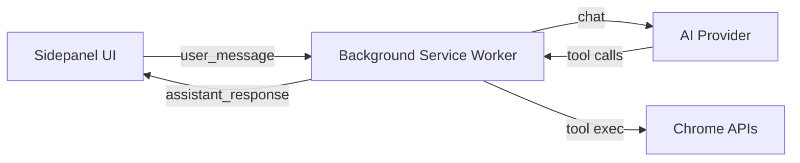
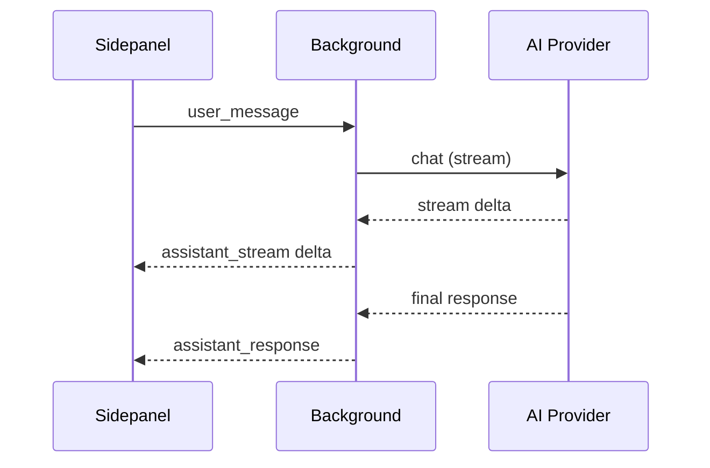

# Parchi

Parchi is a browser sidepanel extension for AI-powered browsing assistance. It pairs a chat UI with tool-driven browser automation so you can navigate, read, and act on pages without leaving your workflow.

## What it does

- Chat-driven browser automation with tool execution
- Inline tool-call timeline + reasoning during streaming
- Session history and profile-driven settings

## Architecture

## Streaming flow

## Quality

Last verified: 2026-01-21

| Check | Command | Result |
| --- | --- | --- |
| Unit tests | `npm run test:unit` | 31/31 passing |

## Development

- `npm install`
- `npm run build`
- Load the unpacked extension from `dist/` in Chrome
