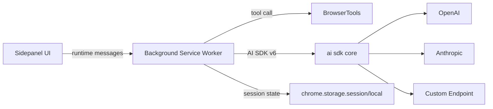
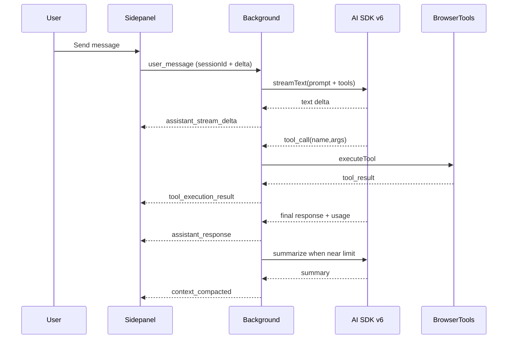

# Plan: AI SDK v6 + UI Redesign + Context Compaction

## Current Views (UI surfaces)
| View / Surface | DOM root | Entry points | Purpose | Notes |
| --- | --- | --- | --- | --- |
| Chat (Live) | `#chatInterface` | Default view, `Live` tab | Primary conversation + actions | Hosts activity rail, messages, composer |
| History | `#historyPanel` | `History` tab | Load past sessions | Reads from `chrome.storage.local` |
| Settings | `#settingsPanel` | Settings button | Profiles + provider config | Multi-tab panel |
| Access (Auth/Billing/Account) | `#accessPanel` (sub: `#authPanel`, `#billingPanel`, `#accountPanel`) | Account button / auth gating | Sign-in + billing | Currently blocked by missing hosted auth |
| Activity rail (overlay) | `#activityPanel` | Activity button | Reasoning + tool log | Shown/hidden within chat |
| Tab selector (overlay) | `#tabSelector` | Tab selector button | Choose tabs for context | Overlay list |

**Count:** 4 primary views + 2 overlays.

## Account/Billing Reality Check
| Area | Current behavior | Issue | Plan direction |
| --- | --- | --- | --- |
| Account creation | Device code + email flow in server | No hosted login UI; requires base URL | Keep device-code flow but add a hosted portal or magic-link page; until then, provide token-only fallback |
| Billing | Stripe checkout + portal endpoints | Requires auth token | Gate billing behind account token; add “bring your own token” path with clear messaging |
| OAuth | Not present | No redirect target | Avoid OAuth until a hosted site exists; stick to device code or magic-link flow |

Assumption: without a hosted login site, the most reliable path is device-code + magic-link or token-based sign-in.

## Component Inventory (Stay vs Renew)
| Component | Location | Keep | Renew | Replace | Notes |
| --- | --- | --- | --- | --- | --- |
| Header (brand + account + settings) | `sidepanel/panel.html`, `sidepanel/panel.css` |  | X |  | Visual/structure refresh |
| View tabs (Live/History) | `sidepanel/panel.html` | X |  |  | Minor styling updates |
| Status bar + activity toggle | `sidepanel/panel.ts`, `sidepanel/panel.css` |  | X |  | Rework layout + labels |
| Activity rail (thinking + tools) | `panel.html`, `panel.ts`, `panel.css` |  | X |  | Replace with structured cards |
| Tool log rendering | `panel.ts` |  |  | X | New UI message store + AI SDK streams |
| Chat message renderer | `panel.ts` |  | X |  | Keep core markdown rendering, update layout |
| Composer (input, tabs, attach) | `panel.html`, `panel.ts`, `panel.css` | X |  |  | Style updates only |
| Tab selector overlay | `panel.html`, `panel.ts` | X |  |  | Only visual polish |
| Settings forms | `panel.html`, `panel.ts` | X |  |  | Keep structure, polish layout |
| Auth/billing panels | `panel.html`, `panel.ts` |  | X |  | UI refresh + flow fixes |
| History list | `panel.ts`, `panel.html`, `panel.css` | X |  |  | Style update |
| AI provider wrapper | `ai/provider.ts` |  |  | X | Replace with AI SDK v6 |
| Message schema utils | `ai/message-schema.ts` |  | X |  | Deduplicate + relocate shared utilities |

## UX Flows (current vs target)
| Flow | Current path | Problems | Target path |
| --- | --- | --- | --- |
| Settings edit | Settings panel -> edit profile -> save | Mixed settings + profiles | Split “General” vs “Agent Library” with clearer save semantics |
| Model/provider config | Profile form -> save | No validation, no AI SDK mapping | SDK-backed config with validation + provider-specific hints |
| Chat & actions | Send message -> background loops tools -> tool log | Tool events are messy; reasoning cluttered | AI SDK UI streams -> structured tool cards + reasoning rail |
| History | Save 20 sessions in `chrome.storage.local` | No compaction markers | Persist compaction markers + summary previews |
| Session creation | Manual “New Session” | No automatic rollover | Auto-compact when near limit, keep same UI session |
| Account/billing | Email device code + Stripe endpoints | No hosted auth UI | Device code + magic-link/token fallback |

## Extension Constraints (standardization rules)
| Constraint | Impact | Design choice |
| --- | --- | --- |
| Service worker background | No long-lived DOM | Keep state in storage + in-memory session map |
| No external module loading | AI SDK must bundle | Add bundler step in `scripts/build.mjs` |
| Storage limits | History is capped | Add summary markers, keep transcript <= 200 msgs |
| Tool permissions | Must fail-closed | Wrap tools in permission checks |
| Tab APIs | Must use selected tabs | Explicit selected tab context appended |

## Target Architecture (mermaid)

## Runtime Sequence (chat + tools + compaction)

## Workstreams (table-driven)
| Stream | Output | Dependencies |
| --- | --- | --- |
| Types + utilities | Shared chat/tool helpers + runtime message schema | None |
| AI SDK v6 core | SDK adapter + tool definitions | Bundler |
| Background rewrite | SDK-driven streaming + tool loop | SDK adapter |
| Context manager | Auto-compaction + session rollover | SDK adapter |
| UI redesign | New layout + styles | None |
| UI behavior | UI message store + tool cards | Background runtime messages |
| History alignment | Compaction markers + session continuity | Context manager |
| Tests | New unit/integration coverage | All above |

## Compaction Design (1-2k tokens)
| Item | Value | Notes |
| --- | --- | --- |
| Threshold | 85% of contextLimit | Configurable in settings |
| Summary size | 1k-2k tokens | Enforced by prompt + `maxTokens` |
| Storage | Summary + recent turns | Stored in session state |
| UI | Marker in transcript | Shows summary preview |

## Build + Test Matrix
| Area | Command | Expected |
| --- | --- | --- |
| Build | `npm run build` | `dist/` updated and loadable |
| Typecheck | `npm run typecheck` | No TS errors |
| Unit tests | `npm run test:unit` | All tests pass |
| Manual QA | Load `dist/` | Streams + tools + compaction work |

## Deliverables
- Workpack: `work/ai-sdk-v6-integration-ui-redesign-context-compaction/`
- Updated `plan.md` (this file)
